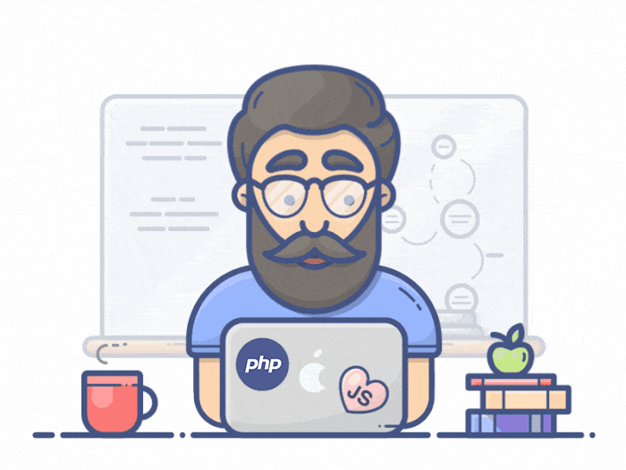

# PentavalueTask
## Summary
This Project Structured Using SOLID & MVC Pattern
``Micro Frame Work`` Inpired From Art Of Laravel Structure build by Native Code using PSR-4 Standard Some Help From AI To Gen Fronted Design Structure Build By Me :)



## Tree Project
```
│   .env.example
│   .gitignore
│   composer.json
│   destroy.bat
│   docker-compose.yml
│   Dockerfile
│   fly.toml
│   frame.gif
│   index.php
│   Installation.bat
│   LICENSE
│   README.md
│   Redis.php
│   server.php
│   start-all.bat
│
├───App
│   │   SalesController.php
│   │
│   ├───Events
│   │       getAnalyticsData.php
│   │
│   ├───Helpers
│   │       ResponseHelper.php
│   │
│   ├───Repositories
│   │       OrderRepository.php
│   │       ProductRepository.php
│   │
│   └───Services
│           OrderService.php
│           ProductService.php
│
├───Connectivity
│       DB.php
│       DBConnectionInterface.php
│       MySQLConnection.php
│
├───docs
│       Backend Task.pdf
│       Real-Time Sales Dashboard.wav
│       RealTime Orders Revenue.postman_collection.json
│
├───MindMap
│       Router.php
│
├───node-ws
│       docker-compose.yml
│       Dockerfile
│       package.json
│       server.js
│
└───public
        .htaccess
        index.php
        router.php
        test-api.php```

```

## Installation
#### Automatic [Online](https://pentavaluetask-production.up.railway.app/index.php)
Run `Installation.bat` to install composer and copy `.env.example` => `.env`  then Run `start-all.bat` to run Server & Socket
- [http://127.0.0.1:8000](http://127.0.0.1:8000/)

#### Manual
- `cp .env.example .env`
- `composer install`
- `php -S 127.0.0.1:8000`
- `php server.php` | `php Redis.php`
- run server on [http://127.0.0.1:8000](http://127.0.0.1:8000/)
## Environment Variables

To run this project, you will need to add the following environment variables to your .env file

Connection:

`DB_HOST`

`DB_NAME`

`DB_USERNAME`

`DB_PASSWORD`

`DB_PORT`

API INTEGRATIONS:

`OPENAI_API_KEY`

`WATHER_API_KEY`
, `CITY`


Socket Live Handle:
`URL_SOCKET`
`APP_ENV`
`REDIS_HOST`

## Authors

[Website](https://www.coder79.me/)
| [Linkedin](https://www.linkedin.com/in/devahmedsaeed/)
| [Youtube](https://www.youtube.com/AhmedSaeedcoder79/)

